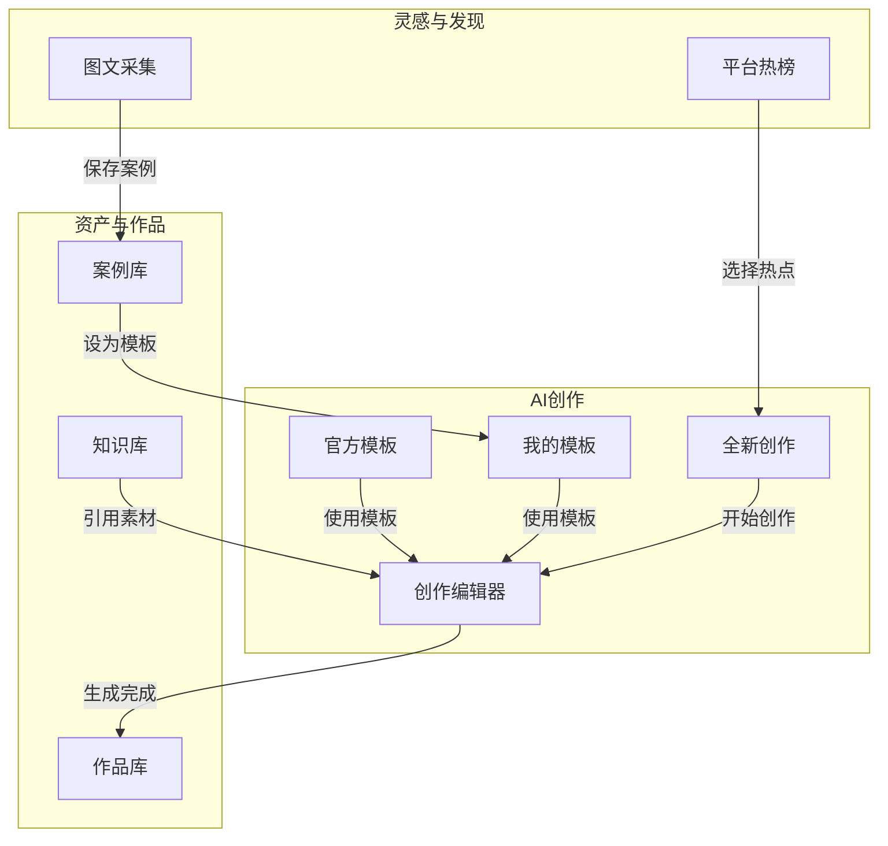

# 🎨 Tupal 前端页面重构设计方案

> **设计时间**: 2024年12月  
> **设计目标**: 根据业务需求重新规划三大核心页面结构  
> **设计原则**: 功能聚焦、用户体验优先、代码复用

---

## 📋 目录

1. [需求分析](#需求分析)
2. [架构对比](#架构对比)
3. [新页面结构设计](#新页面结构设计)
4. [路由配置设计](#路由配置设计)
5. [组件变更清单](#组件变更清单)
6. [数据流设计](#数据流设计)
7. [实施计划](#实施计划)

---

## 🎯 需求分析

### 用户需求概述

| 页面 | 核心功能 | 设计目标 |
|------|----------|----------|
| **灵感与发现** | 平台热榜 + 图文采集 | 精简功能，聚焦灵感获取 |
| **AI创作** | 全新创作 + 模板库 | 整合创作入口，提供模板支持 |
| **资产与作品** | 作品 + 知识 + 案例 | 细分资产类型，支持复用 |

### 功能变更详情

#### 1. 灵感与发现页面
- ✅ **保留**: 平台热榜数据展示
- ✅ **保留**: 图文采集功能（小红书等平台）
- ❌ **移除**: 模板广场（移至AI创作页面）
- ❌ **移除**: 灵感首页的模板预览区

#### 2. AI创作页面
- ✅ **保留**: 全新创作功能
- ➕ **新增**: 官方创作模板区
- ➕ **新增**: 个人采集模板区（来自案例库）
- ❌ **移除**: 独立的模板创作页面（整合到主页面）

#### 3. 资产与作品页面
- 🔄 **重构**: 分为三个独立Tab
  - **作品**: 历史生成的图文内容
  - **知识**: 可复用的图片或文本素材
  - **案例**: 采集的优秀案例（可用于模板创作）

---

## 🔄 架构对比

### 现有架构

```
/inspiration (灵感与发现)
├── / (InspirationHome) - 首页导航
├── /trending (TrendingTopics) - 热点话题
├── /collector (ContentCollector) - 内容采集
└── /templates (TemplateGallery) - 模板广场 ❌ 移除

/creation (AI创作)
├── /new (NewCreation) - 全新创作
└── /template/:id (TemplateCreation) - 模板创作 ❌ 重构

/workspace (资产与作品)
├── /works (Works) - 作品库
└── /assets (Assets) - 资产库 ❌ 重构
```

### 新架构

```
/inspiration (灵感与发现) - 精简版
├── / (InspirationView) - 主视图容器
├── /trending (TrendingTopics) - 平台热榜 ✅ 保留
└── /collector (ContentCollector) - 图文采集 ✅ 保留

/creation (AI创作) - 整合版
├── / (CreationHome) - 创作主页 ➕ 新增
│   ├── 全新创作区域
│   ├── 官方模板区域
│   └── 个人模板区域
└── /editor (CreationEditor) - 创作编辑器 🔄 重构

/workspace (资产与作品) - 三分版
├── / (WorkspaceView) - 主视图容器
├── /works (WorksTab) - 作品库 ✅ 保留
├── /knowledge (KnowledgeTab) - 知识库 ➕ 新增
└── /cases (CasesTab) - 案例库 ➕ 新增
```

---

## 🏗️ 新页面结构设计

### 1. 灵感与发现页面

#### 页面布局

```
┌─────────────────────────────────────────────────────────┐
│                    顶部导航栏                            │
├─────────────────────────────────────────────────────────┤
│  ┌─────────────────────────────────────────────────┐   │
│  │              页面标题: 灵感与发现                  │   │
│  │              副标题: 探索热点，采集灵感            │   │
│  └─────────────────────────────────────────────────┘   │
│                                                         │
│  ┌──────────────────┐  ┌──────────────────┐            │
│  │    平台热榜       │  │    图文采集       │            │
│  │   Tab 按钮       │  │   Tab 按钮       │            │
│  └──────────────────┘  └──────────────────┘            │
│                                                         │
│  ┌─────────────────────────────────────────────────┐   │
│  │                                                   │   │
│  │              内容区域 (router-view)               │   │
│  │                                                   │   │
│  │   - 热榜: 多平台热榜卡片网格                       │   │
│  │   - 采集: 链接输入 + 预览 + 保存                   │   │
│  │                                                   │   │
│  └─────────────────────────────────────────────────┘   │
└─────────────────────────────────────────────────────────┘
```

#### 组件结构

```typescript
// InspirationView.vue - 主容器
<template>
  <div class="inspiration-view">
    <PageHeader title="灵感与发现" subtitle="探索热点，采集灵感" />
    <TabNavigation :tabs="tabs" />
    <router-view />
  </div>
</template>

// tabs 配置
const tabs = [
  { path: '/inspiration/trending', label: '平台热榜', icon: TrendingUp },
  { path: '/inspiration/collector', label: '图文采集', icon: Download }
]
```

---

### 2. AI创作页面

#### 页面布局

```
┌─────────────────────────────────────────────────────────┐
│                    顶部导航栏                            │
├─────────────────────────────────────────────────────────┤
│  ┌─────────────────────────────────────────────────┐   │
│  │              页面标题: AI创作                     │   │
│  │              副标题: 智能内容生成                  │   │
│  └─────────────────────────────────────────────────┘   │
│                                                         │
│  ╔═════════════════════════════════════════════════╗   │
│  ║              全新创作区域                         ║   │
│  ║  ┌─────────────────────────────────────────┐    ║   │
│  ║  │  主题输入框 (支持@引用素材)               │    ║   │
│  ║  │  [开始创作] 按钮                         │    ║   │
│  ║  └─────────────────────────────────────────┘    ║   │
│  ╚═════════════════════════════════════════════════╝   │
│                                                         │
│  ┌─────────────────────────────────────────────────┐   │
│  │  模板区域标题: 创作模板                          │   │
│  │  ┌──────────┐ ┌──────────┐                      │   │
│  │  │ 官方模板  │ │ 我的模板  │  <- Tab切换          │   │
│  │  └──────────┘ └──────────┘                      │   │
│  │                                                   │   │
│  │  ┌────┐ ┌────┐ ┌────┐ ┌────┐ ┌────┐            │   │
│  │  │模板│ │模板│ │模板│ │模板│ │模板│  <- 模板卡片  │   │
│  │  │ 1  │ │ 2  │ │ 3  │ │ 4  │ │ 5  │            │   │
│  │  └────┘ └────┘ └────┘ └────┘ └────┘            │   │
│  └─────────────────────────────────────────────────┘   │
└─────────────────────────────────────────────────────────┘
```

#### 组件结构

```typescript
// CreationHome.vue - 创作主页
<template>
  <div class="creation-home">
    <!-- 全新创作区域 -->
    <section class="new-creation-section glass-panel-heavy">
      <h2>开始创作</h2>
      <MentionInput v-model="topic" placeholder="描述你的创意想法..." />
      <button @click="startCreation" class="btn-primary">开始创作</button>
    </section>
    
    <!-- 模板区域 -->
    <section class="templates-section">
      <div class="section-header">
        <h2>创作模板</h2>
        <TabSwitch v-model="templateTab" :options="templateTabs" />
      </div>
      
      <div class="templates-grid">
        <TemplateCard 
          v-for="template in currentTemplates" 
          :key="template.id"
          :template="template"
          @use="useTemplate"
        />
      </div>
    </section>
  </div>
</template>

// templateTabs 配置
const templateTabs = [
  { value: 'official', label: '官方模板' },
  { value: 'personal', label: '我的模板' }
]
```

#### 模板数据来源

| 模板类型 | 数据来源 | 说明 |
|----------|----------|------|
| 官方模板 | 后端API `/api/templates?type=official` | 系统预设的创作模板 |
| 我的模板 | 后端API `/api/materials?type=reference&is_template=true` | 用户从案例库标记为模板的内容 |

---

### 3. 资产与作品页面

#### 页面布局

```
┌─────────────────────────────────────────────────────────┐
│                    顶部导航栏                            │
├─────────────────────────────────────────────────────────┤
│  ┌─────────────────────────────────────────────────┐   │
│  │              页面标题: 资产与作品                  │   │
│  │              副标题: 管理你的创作资产              │   │
│  └─────────────────────────────────────────────────┘   │
│                                                         │
│  ┌────────────┐ ┌────────────┐ ┌────────────┐         │
│  │    作品    │ │    知识    │ │    案例    │  <- Tabs │
│  └────────────┘ └────────────┘ └────────────┘         │
│                                                         │
│  ┌─────────────────────────────────────────────────┐   │
│  │                                                   │   │
│  │              内容区域 (router-view)               │   │
│  │                                                   │   │
│  │   作品Tab: 历史生成的图文卡片网格                  │   │
│  │   知识Tab: 可复用素材 (图片/文本) 卡片网格         │   │
│  │   案例Tab: 采集的优秀案例卡片网格                  │   │
│  │                                                   │   │
│  └─────────────────────────────────────────────────┘   │
└─────────────────────────────────────────────────────────┘
```

#### 三个Tab的功能定义

| Tab | 功能 | 数据来源 | 操作 |
|-----|------|----------|------|
| **作品** | 展示历史生成的图文 | `/api/history` | 查看、编辑、删除、重新生成 |
| **知识** | 展示可复用的素材 | `/api/materials?type=text,image` | 添加、编辑、删除、引用 |
| **案例** | 展示采集的优秀案例 | `/api/materials?type=reference` | 查看、设为模板、删除 |

#### 组件结构

```typescript
// WorkspaceView.vue - 主容器
<template>
  <div class="workspace-view">
    <PageHeader title="资产与作品" subtitle="管理你的创作资产" />
    
    <TabNavigation :tabs="tabs" />
    
    <router-view />
  </div>
</template>

// tabs 配置
const tabs = [
  { path: '/workspace/works', label: '作品', icon: FileText, description: '历史生成的图文' },
  { path: '/workspace/knowledge', label: '知识', icon: Database, description: '可复用的素材' },
  { path: '/workspace/cases', label: '案例', icon: Bookmark, description: '采集的优秀案例' }
]
```

#### 案例Tab特殊功能

```typescript
// CasesTab.vue - 案例库
<template>
  <div class="cases-tab">
    <div class="cases-grid">
      <CaseCard 
        v-for="caseItem in cases" 
        :key="caseItem.id"
        :case="caseItem"
        @view="viewCase"
        @use-as-template="markAsTemplate"  <!-- 设为模板 -->
        @delete="deleteCase"
      />
    </div>
  </div>
</template>

// 设为模板功能
const markAsTemplate = async (caseItem) => {
  await materialApi.updateMaterial(caseItem.id, {
    is_template: true,
    template_name: caseItem.title
  })
  // 标记后，该案例会出现在AI创作页面的"我的模板"中
}
```

---

## 🛤️ 路由配置设计

### 新路由结构

```typescript
// frontend/src/router/index.ts

const routes = [
  {
    path: '/',
    redirect: '/inspiration/trending'
  },
  
  // 板块一：灵感与发现 (精简版)
  {
    path: '/inspiration',
    component: () => import('../views/Inspiration/InspirationView.vue'),
    meta: { navKey: 'inspiration' },
    children: [
      {
        path: '',
        redirect: '/inspiration/trending'
      },
      {
        path: 'trending',
        name: 'trending',
        component: () => import('../views/Inspiration/TrendingTopics.vue'),
        meta: { navKey: 'inspiration', title: '平台热榜' }
      },
      {
        path: 'collector',
        name: 'collector',
        component: () => import('../views/Inspiration/ContentCollector.vue'),
        meta: { navKey: 'inspiration', title: '图文采集' }
      }
    ]
  },
  
  // 板块二：AI创作 (整合版)
  {
    path: '/creation',
    component: () => import('../views/Creation/CreationView.vue'),
    meta: { navKey: 'creation' },
    children: [
      {
        path: '',
        name: 'creation-home',
        component: () => import('../views/Creation/CreationHome.vue'),
        meta: { navKey: 'creation', title: 'AI创作' }
      },
      {
        path: 'editor',
        name: 'creation-editor',
        component: () => import('../views/Creation/CreationEditor.vue'),
        meta: { navKey: 'creation', title: '创作编辑器' }
      }
    ]
  },
  
  // 板块三：资产与作品 (三分版)
  {
    path: '/workspace',
    component: () => import('../views/Workspace/WorkspaceView.vue'),
    meta: { navKey: 'workspace' },
    children: [
      {
        path: '',
        redirect: '/workspace/works'
      },
      {
        path: 'works',
        name: 'works',
        component: () => import('../views/Workspace/WorksTab.vue'),
        meta: { navKey: 'workspace', title: '作品' }
      },
      {
        path: 'knowledge',
        name: 'knowledge',
        component: () => import('../views/Workspace/KnowledgeTab.vue'),
        meta: { navKey: 'workspace', title: '知识' }
      },
      {
        path: 'cases',
        name: 'cases',
        component: () => import('../views/Workspace/CasesTab.vue'),
        meta: { navKey: 'workspace', title: '案例' }
      }
    ]
  },
  
  // 结果页面
  {
    path: '/result',
    name: 'result',
    component: () => import('../views/ResultView.vue'),
    meta: { navKey: 'creation' }
  }
]
```

---

## 📦 组件变更清单

### 需要新增的组件

| 组件名 | 路径 | 功能 |
|--------|------|------|
| `CreationHome.vue` | `views/Creation/` | AI创作主页（整合全新创作+模板区） |
| `CreationEditor.vue` | `views/Creation/` | 创作编辑器（原NewCreation重构） |
| `KnowledgeTab.vue` | `views/Workspace/` | 知识库Tab（可复用素材） |
| `CasesTab.vue` | `views/Workspace/` | 案例库Tab（采集的案例） |
| `TemplateCard.vue` | `components/` | 模板卡片组件 |
| `TabSwitch.vue` | `components/` | Tab切换组件（官方/我的模板） |
| `PageHeader.vue` | `components/` | 页面标题组件（可复用） |

### 需要修改的组件

| 组件名 | 修改内容 |
|--------|----------|
| `InspirationView.vue` | 移除模板广场入口，简化Tab导航 |
| `TrendingTopics.vue` | 移除顶部创作卡片（移至AI创作页面） |
| `WorkspaceView.vue` | 修改Tab配置为三个Tab |
| `Works.vue` → `WorksTab.vue` | 重命名，保持功能不变 |
| `NavigationBar.vue` | 更新导航项描述 |

### 需要删除的组件

| 组件名 | 原因 |
|--------|------|
| `InspirationHome.vue` | 功能整合到InspirationView |
| `TemplateGallery.vue` | 功能移至AI创作页面 |
| `TemplateCreation.vue` | 功能整合到CreationHome |
| `NewCreation.vue` | 重构为CreationEditor |
| `Assets.vue` | 拆分为KnowledgeTab和CasesTab |

---

## 🔄 数据流设计

### 整体数据流



### API 接口设计

#### 模板相关接口

```typescript
// 获取官方模板
GET /api/templates?type=official

// 获取个人模板（从案例库标记的）
GET /api/materials?type=reference&is_template=true

// 将案例设为模板
PATCH /api/materials/:id
{
  "is_template": true,
  "template_name": "模板名称"
}
```

#### 素材分类接口

```typescript
// 获取知识库素材（文本+图片）
GET /api/materials?type=text,image

// 获取案例库素材（参考类型）
GET /api/materials?type=reference
```

---

## 📅 实施计划

### 第一阶段：基础重构 (预计2天) ✅ 已完成

1. **路由重构**
   - [x] 更新 `router/index.ts` 路由配置
   - [x] 调整默认重定向路径

2. **灵感与发现页面精简**
   - [x] 修改 `InspirationView.vue` 移除模板入口
   - [x] 修改 `TrendingTopics.vue` 移除创作卡片
   - [x] 删除 `InspirationHome.vue`
   - [x] 删除 `TemplateGallery.vue`

### 第二阶段：AI创作页面整合 (预计3天) ✅ 已完成

1. **创建新组件**
   - [x] 创建 `CreationHome.vue` 整合创作入口
   - [x] 创建 `CreationEditor.vue` 重构编辑器
   - [x] 创建 `TemplateCard.vue` 模板卡片
   - [x] 创建 `TabSwitch.vue` Tab切换组件

2. **删除旧组件**
   - [x] 删除 `NewCreation.vue`
   - [x] 删除 `TemplateCreation.vue`

### 第三阶段：资产与作品页面拆分 (预计2天) ✅ 已完成

1. **创建新Tab组件**
   - [x] 重命名 `Works.vue` → `WorksTab.vue`
   - [x] 创建 `KnowledgeTab.vue` 知识库
   - [x] 创建 `CasesTab.vue` 案例库

2. **修改容器组件**
   - [x] 更新 `WorkspaceView.vue` Tab配置

3. **删除旧组件**
   - [x] 删除 `Assets.vue` (不存在，无需删除)

### 第四阶段：功能联调 (预计2天)

1. **数据流联调**
   - [ ] 案例设为模板功能
   - [ ] 模板在AI创作页面展示
   - [ ] 素材引用功能验证

2. **UI/UX优化**
   - [ ] 统一样式风格
   - [ ] 添加过渡动画
   - [ ] 响应式适配

---

## 📊 风险评估

| 风险项 | 影响程度 | 应对措施 |
|--------|----------|----------|
| 数据迁移 | 中 | 保持API兼容，渐进式迁移 |
| 用户习惯 | 低 | 保持核心功能位置不变 |
| 组件依赖 | 中 | 先分析依赖关系再删除 |

---

## 🎉 预期成果

1. **功能更聚焦**: 每个页面职责更清晰
2. **用户体验提升**: 创作流程更顺畅
3. **代码更简洁**: 移除冗余组件和路由
4. **扩展性更好**: 模板系统可持续扩展

---

**文档版本**: v1.0  
**创建时间**: 2024-12-12  
**维护者**: Tupal 开发团队