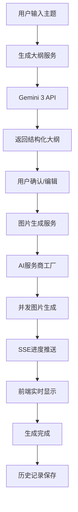

# 图宝 - AI小红书图文生成器项目架构设计

## 项目概述
图宝是一个基于AI的小红书图文生成器，通过输入一句话自动生成完整的小红书图文内容，包括文案大纲和配套图片。

## 技术架构

### 后端架构 (Flask)
```
backend/
├── app.py                 # Flask主应用，RESTful API + SSE
├── config.py             # 配置文件
├── requirements.txt      # Python依赖
├── api/
│   ├── __init__.py
│   ├── routes.py         # API路由定义
│   └── middleware.py     # 中间件（CORS等）
├── services/
│   ├── __init__.py
│   ├── outline_service.py    # 大纲生成服务
│   ├── image_service.py      # 图片生成服务
│   ├── history_service.py    # 历史管理服务
│   └── progress_service.py   # 进度管理服务
├── generators/
│   ├── __init__.py
│   ├── factory.py        # AI服务商工厂
│   ├── base_generator.py # 生成器基类
│   ├── gemini_generator.py   # Gemini 3 API
│   ├── nano_generator.py     # Nano banana Pro
│   └── openai_generator.py   # OpenAI兼容API
├── utils/
│   ├── __init__.py
│   ├── image_utils.py    # 图片处理工具
│   ├── file_utils.py     # 文件操作工具
│   └── sse_utils.py      # SSE工具
└── storage/
    ├── __init__.py
    └── history_storage.py # 历史数据存储
```

### 前端架构 (Vue 3 + TypeScript)
```
frontend/
├── package.json          # 项目配置
├── vite.config.ts       # Vite配置
├── tsconfig.json        # TypeScript配置
├── index.html           # 入口HTML
├── src/
│   ├── main.ts          # 应用入口
│   ├── App.vue          # 根组件
│   ├── router/
│   │   └── index.ts     # 路由配置
│   ├── store/
│   │   └── index.ts     # Pinia状态管理
│   ├── components/
│   │   ├── Generator.vue     # 主生成器组件
│   │   ├── Progress.vue      # 进度显示组件
│   │   ├── History.vue       # 历史管理组件
│   │   └── Upload.vue        # 图片上传组件
│   ├── services/
│   │   └── api.ts       # API服务
│   ├── types/
│   │   └── index.ts     # TypeScript类型定义
│   └── utils/
│       └── index.ts     # 工具函数
└── public/
    └── favicon.ico      # 网站图标
```

## 核心功能模块

### 1. 智能大纲生成
- **技术**: Gemini 3 API
- **输入**: 用户主题描述
- **输出**: 6-9页小红书内容大纲
- **文件**: `backend/services/outline_service.py`

### 2. 批量图片生成
- **技术**: 多服务商支持（Nano banana Pro、Google GenAI、OpenAI）
- **并发**: 支持最高25个并发任务
- **比例**: 小红书标准图片比例
- **文件**: `backend/services/image_service.py`, `backend/generators/`

### 3. 实时进度追踪
- **技术**: Flask SSE (Server-Sent Events)
- **功能**: 实时推送生成进度
- **文件**: `backend/utils/sse_utils.py`, `frontend/components/Progress.vue`

### 4. 个性化定制
- **功能**: 参考图片上传、风格匹配
- **技术**: 图片分析和风格提取
- **文件**: `backend/utils/image_utils.py`, `frontend/components/Upload.vue`

### 5. 历史管理
- **功能**: 创作历史保存、重新编辑、下载
- **存储**: 本地文件系统
- **文件**: `backend/services/history_service.py`, `frontend/components/History.vue`

## API接口设计

### RESTful API
- `POST /api/generate-outline` - 生成大纲
- `POST /api/generate-images` - 生成图片
- `GET /api/history` - 获取历史记录
- `GET /api/history/{id}` - 获取特定历史记录
- `DELETE /api/history/{id}` - 删除历史记录
- `POST /api/upload-reference` - 上传参考图片

### SSE端点
- `GET /api/progress/{task_id}` - 获取任务进度

## 数据流设计



## 开发优先级

### 第一阶段：基础架构 (1-2天)
1. 项目目录结构创建
2. Flask后端基础搭建
3. Vue3前端项目初始化

### 第二阶段：核心功能 (3-4天)
1. AI服务商工厂模式实现
2. 智能大纲生成功能
3. 基础图片生成功能

### 第三阶段：高级功能 (2-3天)
1. SSE实时进度推送
2. 并发图片生成优化
3. 参考图片上传和风格匹配

### 第四阶段：界面和完善 (2-3天)
1. 前端核心组件开发
2. 历史管理系统
3. 项目测试和优化

## 技术栈依赖

### 后端依赖
- Flask: Web框架
- Flask-CORS: 跨域支持
- python-socketio: SSE支持
- google-generativeai: Gemini API
- openai: OpenAI API
- Pillow: 图片处理
- python-dotenv: 环境变量管理

### 前端依赖
- vue: 前端框架
- vue-router: 路由管理
- pinia: 状态管理
- axios: HTTP客户端
- typescript: 类型系统
- vite: 构建工具